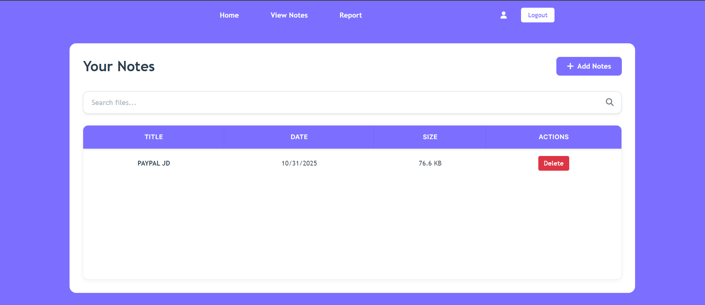
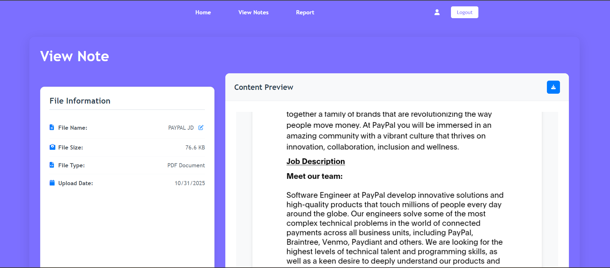
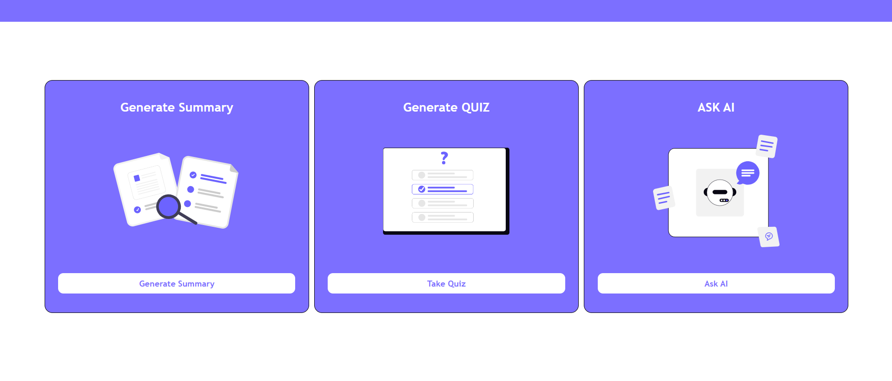
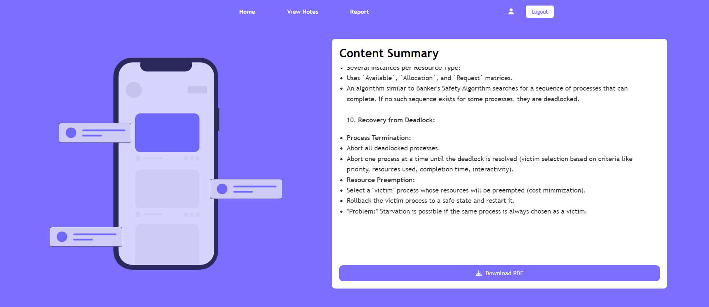
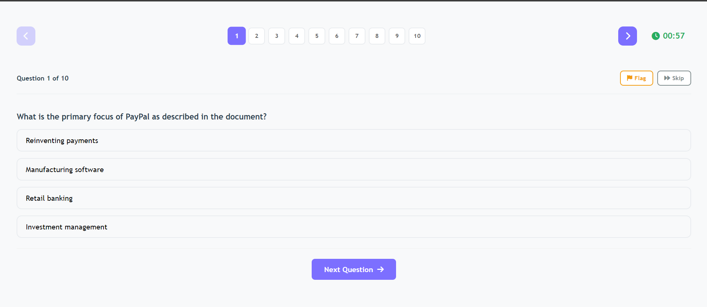
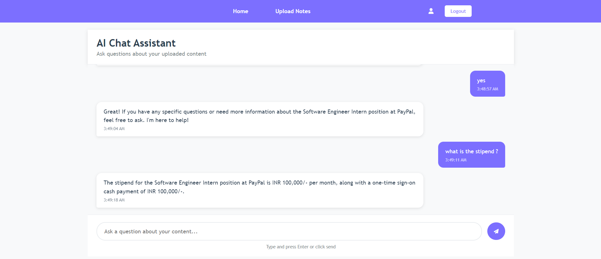

# AI Study Helper

An intelligent web application that revolutionizes the way students study by leveraging AI to create personalized learning experiences. Upload your study materials, get AI-generated summaries, take interactive quizzes, and chat with an AI assistant about your content.


##  User Guide

### Getting Started
1. **Create Account**: Sign up with your email and password
2. **Login**: Access your personalized dashboard
3. **Upload Materials**: Start by uploading your study documents


### Uploading Notes
- Click "Upload Notes" on the dashboard
- Drag and drop PDF files or browse your computer
- Support for multiple file formats
- Automatic processing and text extraction



### View Notes 
- Navigate to your uploaded notes
- Click "View Notes" for any document
- View the uploaded notes


### Generating Summaries
- Navigate to your uploaded notes
- Click "Generate Summary" for any document
- AI processes the content and creates a concise summary
- Save and access summaries anytime



### Taking Quizzes
- Select "Generate Quiz" for any uploaded material
- Answer multiple-choice questions
- Get instant feedback and scoring
- Review detailed performance reports



### AI Chat Feature
- Click "Chat with AI" to start a conversation
- Ask questions about your uploaded content
- Get contextual answers and explanations
- Maintain conversation history




## ✨ Features

###  Document Upload
- **Multi-format Support**: Upload PDF documents or text notes
- **Drag & Drop Interface**: Intuitive file upload experience
- **Automatic Processing**: Text extraction from PDFs using python
- **File Management**: Organize and manage all your study materials

###  AI-Powered Summaries
- **Intelligent Summarization**: Generate concise summaries using Google's Gemini AI
- **Context-Aware**: Summaries capture key concepts and important details
- **One-Click Generation**: Instant summary creation for any uploaded document
- **Persistent Storage**: Save and access summaries anytime

###  Interactive Quizzes
- **Auto-Generated Questions**: AI creates relevant multiple-choice questions
- **Adaptive Learning**: Questions based on your uploaded content
- **Performance Tracking**: Monitor your progress and scores

###  AI Chat Assistant
- **Content-Specific Q&A**: Ask questions about your uploaded materials
- **Contextual Responses**: AI understands and references your documents
- **Study Support**: Get explanations, clarifications, and study tips
- **Conversation History**: Maintain chat history for continuous learning

###  Secure User Management
- **User Authentication**: Secure login and registration system
- **Data Privacy**: Secure storage and handling of user information

## 🚀 Quick Start

### Prerequisites
- **Python 3.8+**
- **MySQL Server 8.0+**
- **Node.js 16+** (for frontend development)
- **Git**

### Installation

1. **Clone the Repository**
   ```bash
   git clone https://github.com/CHINMAYBHT/WEB_TECH_PROJECT.git
   cd WEB_TECH_PROEJCT
   ```

2. **Set Up Python Environment**
   ```bash
   # Install Python dependencies
   pip install -r requirements.txt
   ```

3. **Configure Environment Variables**
   ```bash
   cp .envExample .env
   ```

   Edit `.env` with your configuration:
   ```env
   DB_HOST=localhost
   DB_USER=your_mysql_username
   DB_PASSWORD=your_mysql_password
   DB_NAME=ai_study_helper
   GEMINI_API_KEY=your_gemini_api_key
   OPENROUTER_API_KEY1=your_openrouter_api_key
   OPENROUTER_API_KEY2=your_openrouter_api_key
   MODEL_NAME=gpt-4o-mini
   ```

4. **Set Up Database**
   ```sql
   CREATE DATABASE ai_study_helper;
   ```
   ```bash
   mysql -u your_username -p ai_study_helper < DATABASE/init.sql
   ```

5. **Start the Application**
   ```bash
   # Start PHP server (Backend)
   php -S localhost:8080 -c "C:\php\php.ini"


## 🛠️ Technology Stack

### Backend
- **PHP 8.0+**: Server-side logic and API endpoints
- **MySQL 8.0+**: Database management
- **Python 3.8+**: AI processing and automation

### Frontend
- **HTML5**: Semantic markup and structure
- **CSS3**: Modern styling and responsive design
- **JavaScript (ES6+)**: Interactive user interfaces
- **Browser Sync**: Development server with live reload

### AI & APIs
- **Google Gemini AI**: Advanced text summarization
- **OpenRouter API**: Multiple LLM access (GPT, Claude, etc.)
- **PyPDF2**: PDF text extraction
- **MySQL Connector**: Database connectivity

### Development Tools
- **Git**: Version control
- **Composer**: PHP dependency management
- **Pip**: Python package management
- **Browser Sync**: Frontend development server

## 📁 Project Structure

```
WEB_TECH_PROEJCT/
├── BACKEND/                 # PHP API endpoints
│   ├── auth.php            # User authentication
│   ├── generateSummary.php # Summary generation API
│   ├── generateQuiz.php    # Quiz generation API
│   └── ...
├── DATABASE/               # Database files
│   ├── init.sql           # Database schema
│   └── queries.php        # Database operations
├── LOGS/                  # Application logs
├── public/                # Frontend files
│   ├── index.html         # Login page
│   ├── assets/
│   │   ├── CSS/          # Stylesheets
│   │   ├── JS/           # JavaScript files
│   │   ├── images/       # Static images
│   │   └── pages/        # HTML pages
│   └── uploads/          # User uploaded files
├── .env                   # Environment configuration
├── .envExample           # Environment template
├── requirements.txt      # Python dependencies
├── setup.md             # Detailed setup guide
├── summary_generator.py # AI summary generation
├── chat_response.py     # AI chat processing
└── README.md           # This file
```

## API Endpoints

### Authentication
- `POST /BACKEND/auth.php` - User login
- `POST /BACKEND/createAcc.php` - User registration
- `GET /BACKEND/loginStatus.php` - Check login status

### Notes Management
- `POST /BACKEND/saveNote.php` - Upload/save notes
- `GET /BACKEND/getNotes.php` - Retrieve user notes
- `DELETE /BACKEND/deleteNote.php` - Delete notes

### AI Features
- `POST /BACKEND/generateSummary.php` - Generate AI summaries
- `POST /BACKEND/generateQuiz.php` - Generate AI quizzes
- `POST /BACKEND/startChat.php` - Start AI chat session

### Analytics
- `GET /BACKEND/getQuizReport.php` - Quiz performance reports
- `POST /BACKEND/submitFeedback.php` - User feedback

##  Acknowledgments

- **Google Gemini AI** for powerful text processing capabilities
- **OpenRouter** for providing access to multiple AI models
- **PyPDF2** for reliable PDF text extraction
- **Font Awesome** for beautiful icons
- **Browser Sync** for enhanced development experience
